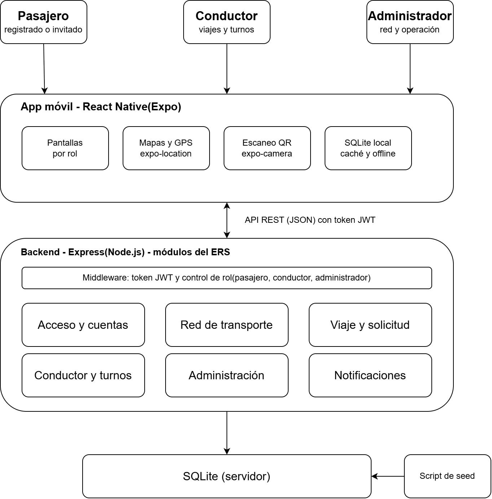

# Arquitectura de VoyBus

## Descripción

VoyBus usa una arquitectura cliente-servidor: una aplicación móvil que se comunica con una API REST, la cual guarda los datos en una base de datos. Los tres roles (pasajero, conductor y administrador) usan la misma app y la misma API, y el backend decide qué puede hacer cada uno según su rol.

## Tecnologías

| Componente | Tecnología |
|---|---|
| App móvil | React Native con Expo (TypeScript) |
| Backend | Node.js con Express |
| Base de datos | SQLite |
| Sesión y seguridad | JWT y contraseñas con hash |

## Justificación

- **React Native con Expo:** una sola app para Android e iOS, que se prueba directo en el teléfono y ofrece módulos de ubicación y cámara.
- **Express:** liviano y adecuado para una API REST modular.
- **SQLite:** no requiere instalar un servidor y los datos iniciales se cargan igual en cualquier computador.
- **API única con roles:** concentra los permisos en un solo lugar en vez de repetir lógica por usuario.
- **Actualización periódica (polling):** la app consulta al servidor cada pocos segundos para mostrar vehículos y alertas, sin la complejidad de WebSockets.